# Potential Scientific Plots to consider:

## Biochemistry: 

Kinetic Plots:

**Zero order**  
Concentration vs time. Straight line, constant rate regardless of concentration.

**First order**  
Ln(concentration) vs time. Straight line, rate proportional to concentration. Constant half-life.

**Second order**  
1/concentration vs time. Straight line, rate proportional to concentration squared.

Use same data, different axis transforms reveal reaction order from linearity. Perfect for enzyme, drug stability, or reaction monitoring modules.

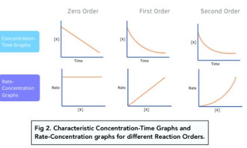

Chromatogram: 

Used to visualise and interpret the separation of components in a mixture during a chromatography run. Readout identifys components of sample and the amount of each component 

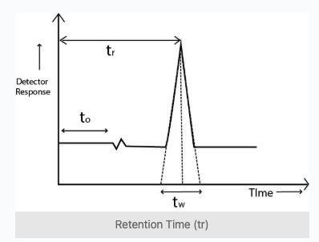
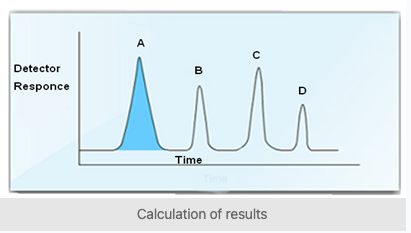

NMR Spectroscopy: 1D

Confirm molecular structure of a compound by analysing seperation, grouping and intensity of peaks. Plots ppm against intensity or absorption.

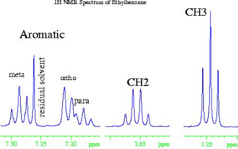

PK Curve:

Visualise how drug conc in plasma changes over time after dosing. C_max T_max and half-life 

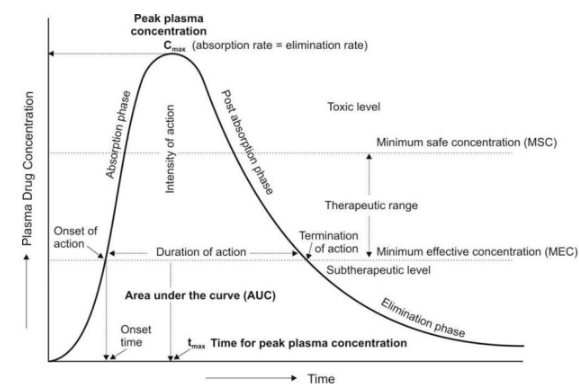

IC50 Curve:

Dose-response curve show how a drug or compound inhibits a biological process: 

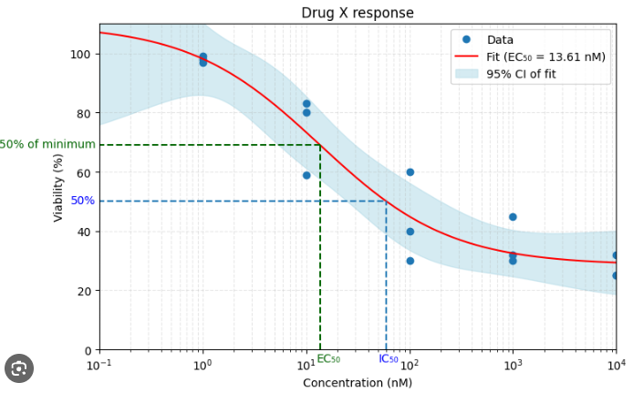

Michaelis Menten Curve:

Biological kinetics of reactions. Substrate and protein interaction curve. 

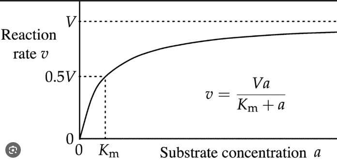

## Biology: 

Survival Curve: 

Shows the survival of a population over time. 

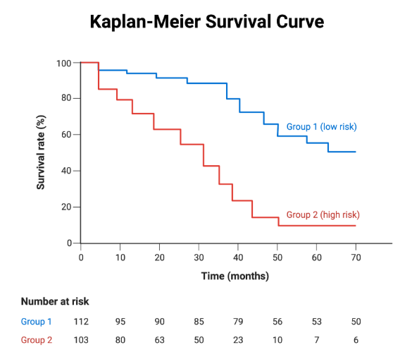

UMAP: 

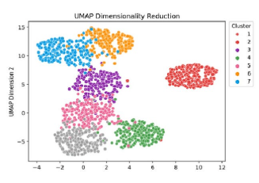

PCA: 

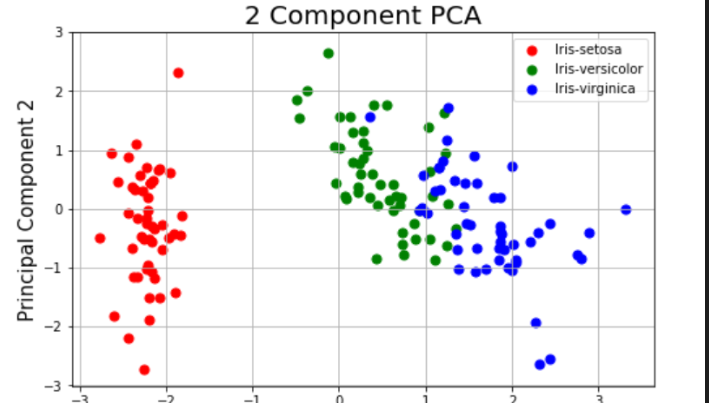

Lineweaver-Burk Plot: 

The double reciprocal transformation of michaelis menten plot. Compare enzymatic kinetics across conditions. Instant K_m and V_max from X and Y intercepts. 

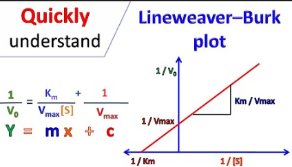

