# Potential Scientific Plots to consider:

> **Already implemented**, and so no longer candidates: the **dose-response
> curve** (`doseResponse`), the **Michaelis-Menten curve** (`michaelisMenten`),
> the **survival curve** (`survivalCurve`), and **UMAP / PCA**, which the
> `dittoDimPlot` and `dittoDimHex` modules cover for any reduction stored on a
> `SingleCellExperiment` / `Seurat` object. The IC50 curve is largely covered by
> `doseResponse`, which fits a log-logistic curve with **drc**; a dedicated
> module would mostly be about reporting the IC50 itself.
>
> Genuinely open: the kinetic order plots, chromatogram, 1D NMR, PK curve, and
> the Lineweaver-Burk plot. Their entries are kept below with the reference
> screenshots.

## Biochemistry: 

Kinetic Plots:

**Zero order**  
Concentration vs time. Straight line, constant rate regardless of concentration.

**First order**  
Ln(concentration) vs time. Straight line, rate proportional to concentration. Constant half-life.

**Second order**  
1/concentration vs time. Straight line, rate proportional to concentration squared.

Use same data, different axis transforms reveal reaction order from linearity. Perfect for enzyme, drug stability, or reaction monitoring modules.

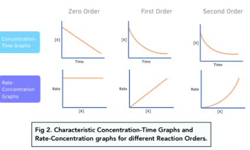

Chromatogram: 

Used to visualise and interpret the separation of components in a mixture during a chromatography run. Readout identifys components of sample and the amount of each component 

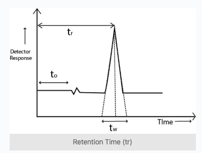
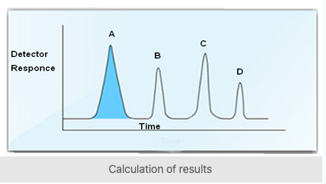

NMR Spectroscopy: 1D

Confirm molecular structure of a compound by analysing seperation, grouping and intensity of peaks. Plots ppm against intensity or absorption.

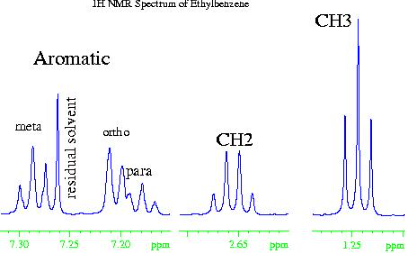

PK Curve:

Visualise how drug conc in plasma changes over time after dosing. C_max T_max and half-life 

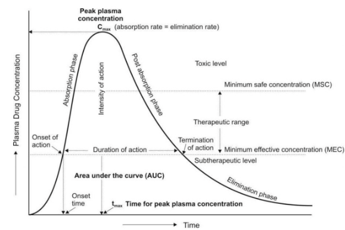

IC50 Curve: *(largely covered by `doseResponse`)*

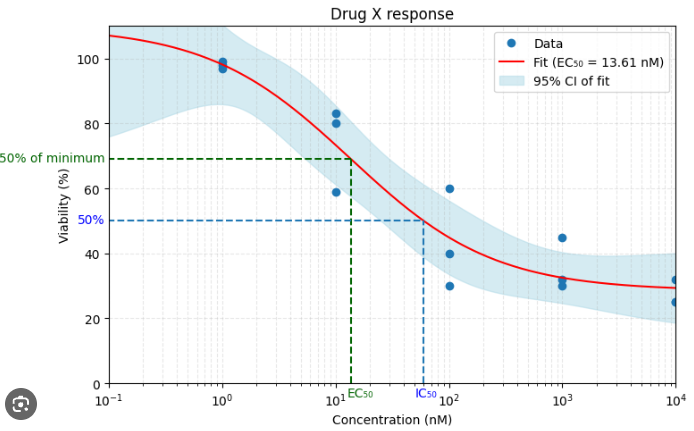

Dose Response Curve: **implemented as `doseResponse`**

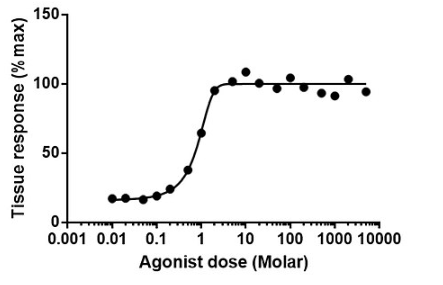

Michaelis Menten Curve: **implemented as `michaelisMenten`**

Biological kinetics of reactions. Substrate and protein interaction curve. 

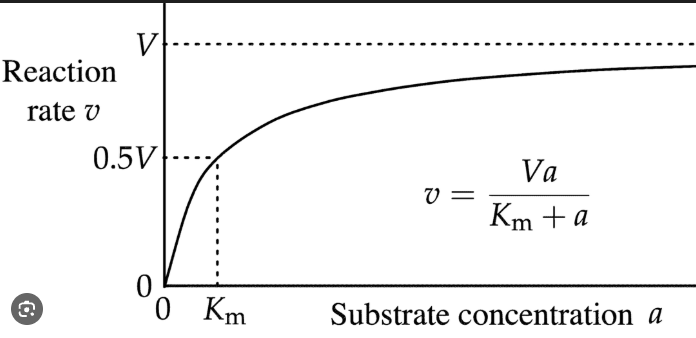

## Biology: 

Survival Curve: **implemented as `survivalCurve`**

Shows the survival of a population over time. 

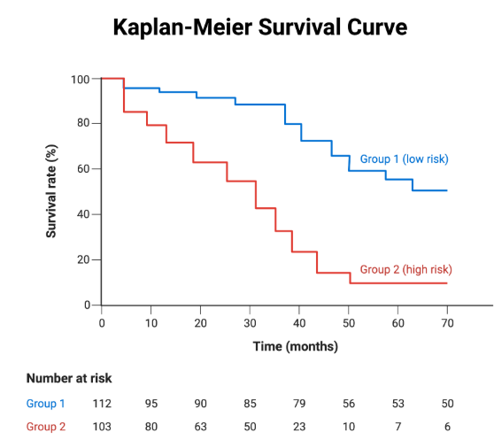

UMAP: **covered by `dittoDimPlot` / `dittoDimHex`**

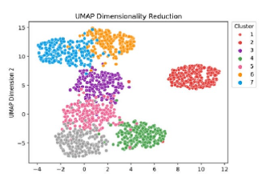

PCA: **covered by `dittoDimPlot`**

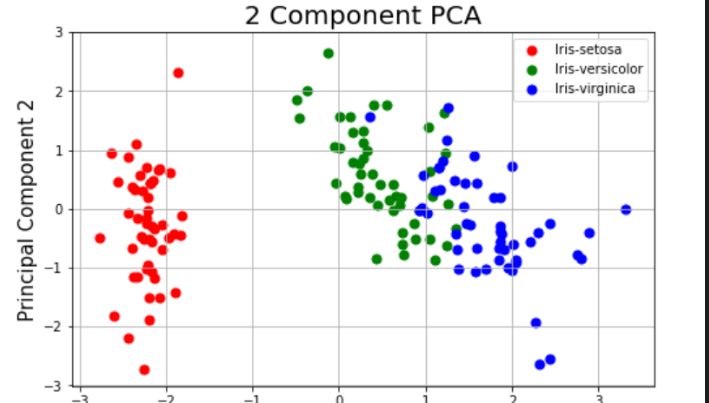

Lineweaver-Burk Plot: 

The double reciprocal transformation of michaelis menten plot. Compare enzymatic kinetics across conditions. Instant K_m and V_max from X and Y intercepts. 

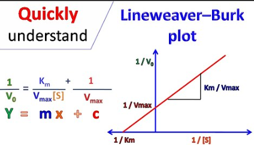

